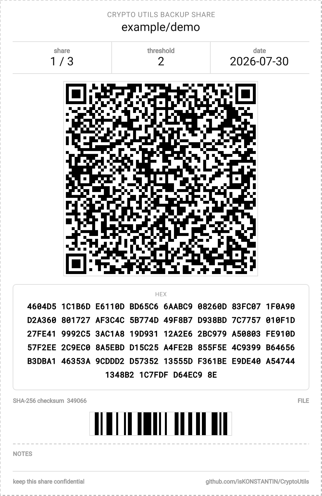

# CryptoUtils

[](https://github.com/isKONSTANTIN/CryptoUtils/actions/workflows/gradle.yml)
[](LICENSE)
[](https://adoptium.net/)
[](https://www.graalvm.org/latest/reference-manual/native-image/)

Terminal program that turns a secret into printable paper backups you can actually store.

## What Is This Thing Good For?

Have you ever thought that writing a mnemonic phrase (or any other secret) on a piece of paper is not the safest storage? Physical damage, loss or declassification is not excluded.

It would be much better if we could safely divide a secret into several parts and distribute them to friends or relatives. A simple split will not work — if we lose even one part, we would not be able to restore the data completely.

CryptoUtils lets you use [Shamir's secret sharing scheme](#shamirs-secret-sharing) to divide a secret into N parts, any K of which are enough to fully restore it — and it prints each part as a labeled, scannable backup card ready for paper storage. It also handles the parts of the job around that: BIP-39 seed phrases, container tags for whatever box or safe a card ends up in, and A4 sheets ready to print and cut.

## How It Works

CryptoUtils is interactive. Run it, type a command name, and it asks for what it needs one question at a time — with tab-completion for file paths and BIP-39 words, and a chance to back out of anything before it touches the disk.

```
$ cryptoutils
cu> backup
```

Everything below was produced by actually running the tool; the files are in [`example/`](example).

```
cu> backup
Backup source type?
  file - File (Read the secret from a file on disk)
  text - Text (Type the secret in directly)
  seed - Seed (Back up a BIP-39 mnemonic phrase)
  hex  - Hex (Reprint a card for a share you already hold)
[file/text/seed/hex] file
Name for these backup copies? demo
Name for the container tags? (empty to skip printing tags) Safe, shelf 2
Split the secret into parts?
  split  - Shamir split (N cards, any K of which restore the secret)
  single - Single card (One card holding the whole secret, no split)
[split/single] split
Total number of parts (N)? 3
Parts required to recover (K)? 2
Path to file? secret.txt

Backup created: 3 parts, 2 required to recover
Type: FILE
QR error correction level: Quartile (3/4)
demo_1.png
demo_2.png
demo_3.png

Tags:
demo_tag_1.png
demo_tag_2.png
demo_tag_3.png

Print sheets:
demo_print_1.png
```

Each share becomes a card carrying a QR code of the share, its hex dump for when no scanner is at hand, and a SHA-256 checksum with a CODE128 barcode so a card can be identified without decoding it. Cards print 56 mm wide; the tags that go on the containers print 25.4 mm tall and as wide as their name needs. All of it is also tiled onto A4 sheets at the same scale, ready to print at 100% and cut.

<p align="center">
  
</p>

Later, any 2 of the 3 shares reconstruct the original. A share can be a card image to scan or the hex block typed in by hand from a card whose QR no longer scans — and the two can be mixed:

```
cu> restore
Backup source type?
  file - File (Restore into a file on disk)
  text - Text (Restore into plain text)
  seed - Seed (Restore a BIP-39 mnemonic phrase)
[file/text/seed] file
Output path for the restored file? recovered.txt
What is on the cards?
  shamir - Shamir shares (Combine several cards, numbered as they were printed)
  whole  - Whole backup (One card holding the entire secret, never split)
[shamir/whole] shamir
How many parts was the backup split into? [2-255] 3
Chunk #1: file path, hex string, or empty to skip: demo_1.png
Chunk #2: file path, hex string, or empty to skip:
Chunk #3: file path, hex string, or empty to skip: demo_3.png

Restored file written to recovered.txt
```

Note the empty answer for chunk #2: a share's number is where it sits in this list, so a share you no longer have keeps its slot rather than being left out. Getting that wrong reconstructs a different secret, not an error message.

## Beyond the Split

`backup` covers three shapes of the same job, and `restore` matches each one:

- **Shamir split** — N cards, any K of them recover the secret. The main case.
- **Single card** — one card holding the whole secret, no split. Restore it with the *whole* mode.
- **Reprint** — a card was lost or damaged, but you wrote its hex down. Feed the hex back with source type `hex`, tell it which share number the card is for, and you get a replacement that combines with its siblings byte for byte.

If a secret is too large to fit a QR code at any error-correction level, the cards are still produced with the hex block alone, and the same hex is written next to them as a `.hex` file — retyping several kilobytes by hand is not a recovery plan.

## Shamir's Secret Sharing

[Shamir's secret sharing](https://en.wikipedia.org/wiki/Shamir%27s_secret_sharing) splits a secret into `N` shares such that any `K` of them (the *threshold*) reconstruct the original secret exactly, while any `K-1` shares reveal nothing about it at all. That means you can, for example, split a seed phrase into 5 shares handed to 5 different people, requiring only 3 of them to cooperate to recover it — tolerant of up to 2 lost or destroyed shares, without any single holder being able to read the secret alone.

The split is the confidentiality boundary: there is no password on top of it. Anyone holding K cards holds the secret, and anyone holding fewer holds nothing.

## Commands

Every command asks its own questions. `help` and `cd` also accept their argument on the same line (`help backup`, `cd ..`).

### Backups

| Command | Description |
|---|---|
| `backup` | Print a file, text or seed phrase onto backup cards — Shamir-split, whole on a single card, or reprinting a card for a share you already hold |
| `restore` | Reconstruct a file, text or seed phrase from backup cards, read from QR codes or typed-in hex |

### Cryptocurrencies

| Command | Description |
|---|---|
| `seed` | Generate, convert, extend and inspect BIP-39 seed phrases, and choose the active wordlist. Modes: `generate`, `from_base`, `from_hex`, `to_base`, `to_hex`, `extend`, `wordlist` |

### Misc

| Command | Description |
|---|---|
| `help` | Show the list of commands, or details of one |
| `cd` | Change current directory |
| `delete` | Overwrite a file with zeros and delete it |
| `exit` / `q` | Exit from CryptoUtils |

## Upgrading from 1.x

Version 2 is a deliberate narrowing: the command set went from 21 aliases to 8, and arguments are no longer passed on the command line.

- **`cryptoutils backup file demo 3 2 secret.txt` no longer works.** Run `cryptoutils`, then `backup`, and answer the prompts. Only `--version` is accepted as an argument.
- **`seed_to_base`, `seed_to_hex`, `hex_to_seed`, `extend_seed` and `wordlist`** are now modes of `seed`. A `from_base` mode was added, which 1.x only had as an undocumented positional argument.
- **`card`, `label` and `qr`** are absorbed by `backup`: reprinting a card is source type `hex`, and a single unsplit card is the `single` split mode. Tags come from answering the tag-name question.
- **`shamir` and `hex` are gone.** `backup` already does Shamir splitting, in a format that `restore` reads; the standalone `shamir` command wrote incompatible `.shp-*` files and mishandled schemes with more than 5 parts.
- **`rsa_key`, `ecdhe_key`, `seed_rsa_cipher` and `seed_ecdhe_cipher` are gone**, along with their hand-rolled crypto. If you have ciphertext produced by them, decrypt it with the last 1.x release before upgrading — nothing in 2.x can read it.

**Cards printed by 1.x still restore in 2.x** for files and text. Seed backups do not: 1.x gzipped the entropy before splitting, 2.x does not, because 16 or 32 bytes of entropy are already as dense as they get. Restore a 1.x seed backup with 1.x, or restore it as *text* in 2.x and convert the result with `seed`.

## Installation

### Native Binary

CI builds a native executable (via [GraalVM native-image](https://www.graalvm.org/latest/reference-manual/native-image/)) for Linux, x86_64 and arm64 — no JVM installation required to run it. Grab `cryptoutils-x86_64` / `cryptoutils-aarch64` from the [latest release](https://github.com/isKONSTANTIN/CryptoUtils/releases/latest). On Windows, use the jar instead (`java -jar CryptoUtils-*.jar`, requires JVM 17+).

To build it yourself, the easiest way is via Docker, which reproduces the same build CI uses:

```
docker buildx build -f docker/native-build.Dockerfile --target export --output type=local,dest=out .
```

The binary is written to `out/cryptoutils`.

Alternatively, without Docker, install a [GraalVM](https://www.graalvm.org/downloads/) JDK (25 or newer) and run:

```
./gradlew nativeCompile
```

The binary is written to `build/native/nativeCompile/cryptoutils`.

### .deb / .rpm Packages

CI also builds `.deb` and `.rpm` packages (installing the native binary to `/usr/bin/cryptoutils`) for x86_64 and arm64 — grab them from the [latest release](https://github.com/isKONSTANTIN/CryptoUtils/releases/latest) as well.

To build them yourself via Docker:

```
docker buildx build -f docker/native-build.Dockerfile --target package-export \
    --build-arg VERSION=2.0.0 --build-arg PKG_ARCH=amd64 \
    --output type=local,dest=out .
```

`PKG_ARCH` is the Debian architecture name (`amd64` or `arm64`) — the `.rpm`'s architecture (`x86_64`/`aarch64`) is derived from it automatically. The packages are written to `out/`.

### Plain Jar

```
./gradlew build
java -jar build/libs/CryptoUtils-*.jar
```

Requires a JVM 17+ (any platform).

## Development

```
./gradlew build   # compile, test and check coverage; produces build/libs/CryptoUtils-*.jar
./gradlew test    # run tests only
./gradlew check   # tests plus the coverage gate on su.knst.crypto.core
```

The build runs on JDK 17. Gradle 8.14 supports JDK 24 and below, so if your default JDK is newer, point the daemon at an older one — for example in a git-ignored `gradle.properties`:

```
org.gradle.java.home=/path/to/jdk-17
```

Building a native binary requires a [GraalVM](https://www.graalvm.org/downloads/) JDK (25 or newer):

```
./gradlew nativeCompile   # produces build/native/nativeCompile/cryptoutils
```

or reproducibly via Docker, see [Installation](#native-binary) above.

The code is in three layers, and the boundary is worth keeping: `core` holds every decision the tool makes and knows nothing about terminals or output formatting; `cli` collects answers from the user and hands them to `core`; `utils` is the leaf helpers underneath both. Commands are prompt sequences, not logic.

## Disclaimer

This software is provided "AS IS", WITHOUT WARRANTY OF ANY KIND. Use at your own risk — double-check the correctness of recovery and the overall operation of the program before relying on it for anything important.
